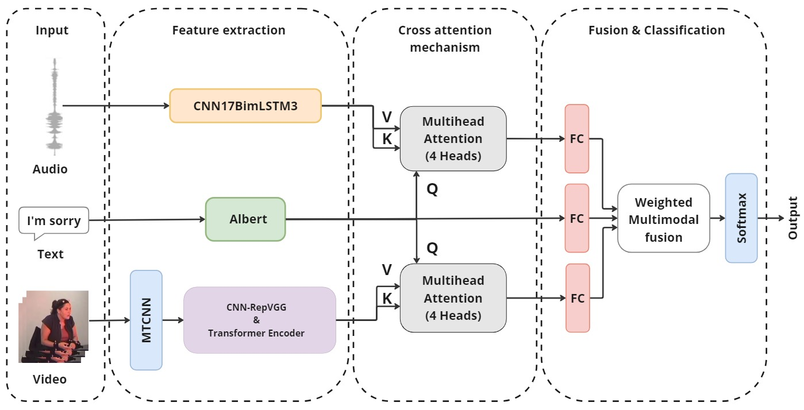
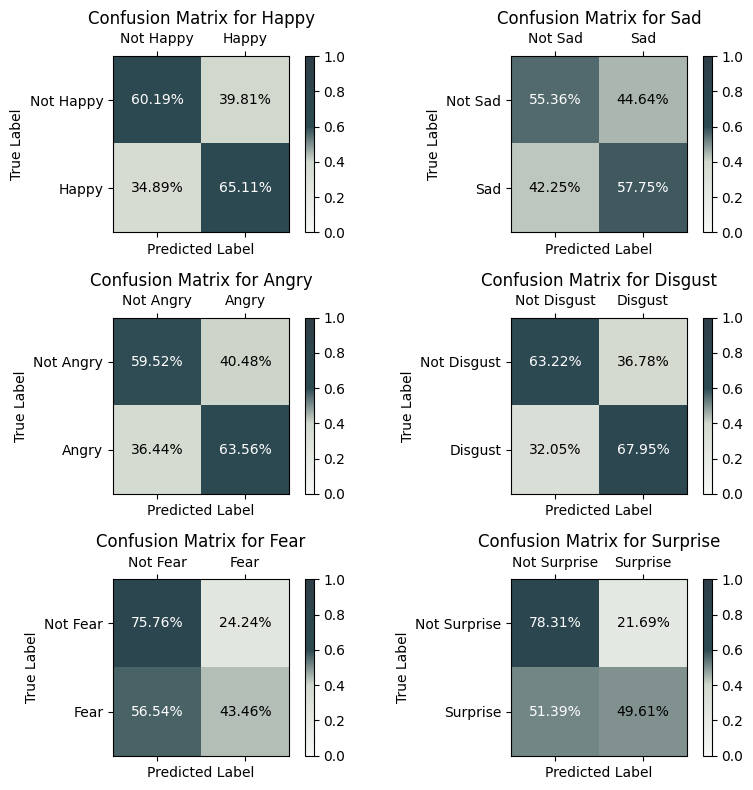

<!-- PROJECT LOGO -->
<br />
<div align="center">
  <a href="https://github.com/alaaNfissi/Multi-Modal-Emotion-Recognition">
    
  </a>

  # Deep Learning Framework for Multi-modal Emotion Recognition in Mental Health Monitoring

  <p align="center">
    A deep learning framework integrating text, audio, and video for emotion recognition.
    <br />
    <strong>Paper submitted for publication.</strong>
    <br />
  </p>
</div>

<div align="center">

[](https://github.com/alaaNfissi/Multi-Modal-Emotion-Recognition/#readme "Go to project documentation")

</div>  

<div align="center">
    <p align="center">
    ·
    <a href="https://github.com/alaaNfissi/Multi-Modal-Emotion-Recognition/issues">Report Bug</a>
    ·
    <a href="https://github.com/alaaNfissi/Multi-Modal-Emotion-Recognition/issues">Request Feature</a>
  </p>
</div>

---

## Overview

This repository provides an implementation of a **Multi-modal Emotion Recognition (MMER) system** as described in the research paper:

> *"Deep Learning Framework for Multi-modal Emotion Recognition in Mental Health Monitoring."*

### Key Features:
- **Audio Processing:** CNNs + bi-directional xLSTM (Bi-xLSTM) for raw waveform analysis.
- **Text Processing:** ALBERT for deep semantic representation.
- **Video Processing:** RepVGG-CNN for facial expression detection.
- **Fusion Mechanism:** Cross-attention to enhance emotion recognition across modalities.
- **Loss Function:** Focal Loss to mitigate class imbalance.

---

## Contents
<details>
  <summary>Table of Contents</summary>
  <ol>
    <li><a href="#abstract">Abstract</a></li>
    <li><a href="#built-with">Built With</a></li>
    <li><a href="#datasets">Datasets</a></li>
    <li><a href="#evaluation-metrics">Evaluation Metrics</a></li>
    <li><a href="#experimental-results">Experimental Results</a></li>
    <li><a href="#comparison-with-state-of-the-art">Comparison with State-of-the-Art</a></li>
    <li><a href="#installation">Installation</a></li>
    <li><a href="#usage">Usage</a></li>
    <li><a href="#project-structure">Project Structure</a></li>
    <li><a href="#paper-reference">Paper Reference</a></li>
    <li><a href="#license">License</a></li>
  </ol>
</details>

---

## Abstract

Multi-modal Emotion Recognition (MMER) enhances human-computer interaction by enabling systems to accurately interpret and respond to human emotions. This research introduces an MMER system integrating **audio, text, and video** modalities for mental health monitoring and suicide prevention.

### Model Components:
- **Audio:** CNNs + Bi-xLSTM for raw waveform processing.
- **Text:** ALBERT for extracting deep semantic representations.
- **Video:** RepVGG-CNN for capturing fine-grained facial expressions.
- **Fusion:** Cross-attention mechanism for multi-modal feature integration.
- **Loss Function:** Focal Loss to handle class imbalance.

The system achieves **88.31% accuracy, 76.43% F1-score on IEMOCAP**, and **65.2% accuracy, 56.5% F1-score on CMU-MOSEI**, surpassing state-of-the-art approaches.

<p align="right">(<a href="#readme-top">back to top</a>)</p>

---

## Built With

### Tools and Libraries

- 
- 
- 
- 
- 
- 

<p align="right">(<a href="#readme-top">back to top</a>)</p>

---

## Model Architecture

<p align="center">
  
</p>

<p align="right">(<a href="#readme-top">back to top</a>)</p>

---

## Datasets

The model is evaluated on two widely used datasets:
1. **IEMOCAP**: A multi-modal dataset for emotion recognition.
2. **CMU-MOSEI**: A dataset for multi-modal sentiment and emotion analysis.

Processed data for both datasets can be downloaded from:
[Download Processed Data](https://hkustconnect-my.sharepoint.com/personal/wdaiai_connect_ust_hk/_layouts/15/onedrive.aspx?id=%2Fpersonal%2Fwdaiai_connect_ust_hk%2FDocuments%2FMME2E%2Fdata%2Ezip&parent=%2Fpersonal%2Fwdaiai_connect_ust_hk%2FDocuments%2FMME2E&ga=1)

<p align="right">(<a href="#readme-top">back to top</a>)</p>

---

## Evaluation Metrics

The model is evaluated using **accuracy** and **F1-score** to ensure robust performance across different emotion classes.

---

## Experimental Results

### IEMOCAP Dataset

**Table 1:** Performance on IEMOCAP (Accuracy, Precision, Recall, F1-score)  

| Class    | Accuracy | Precision | Recall | F1-score |
|----------|----------|-----------|--------|----------|
| Happy    | 87.55%   | 80.83%    | 78.96% | 79.89%   |
| Sad      | 89.53%   | 70.09%    | 76.21% | 73.02%   |
| Angry    | 91.34%   | 81.94%    | 75.64% | 78.67%   |
| Neutral  | 84.84%   | 73.25%    | 75.08% | 74.15%   |
| **Average** | **88.31%** | **76.53%** | **76.47%** | **76.43%** |

#### Confusion Matrix

<p align="center">
  
</p>

<p align="right">(<a href="#readme-top">back to top</a>)</p>

### CMU-MOSEI Dataset

**Table 2:** Performance on CMU-MOSEI (Accuracy, F1-score)  

| Class     | Accuracy | F1-score |
|-----------|----------|----------|
| Happy     | 62.65%   | 63.55%   |
| Sad       | 56.55%   | 57.07%   |
| Angry     | 61.54%   | 62.30%   |
| Disgust   | 65.59%   | 66.38%   |
| Fear      | 59.61%   | 51.83%   |
| Surprise  | 63.64%   | 57.59%   |
| **Average**  | **61.60%** | **59.79%** |

#### Confusion Matrix

<p align="center">
  
</p>

<p align="right">(<a href="#readme-top">back to top</a>)</p>

---

## Comparison with State-of-the-Art

### IEMOCAP Dataset

**Table 3:** Comparison with SOTA Methods on IEMOCAP  

| Method               | Accuracy | Precision | Recall | F1-score |
|----------------------|----------|-----------|--------|----------|
| Babaali et al. (2023)| 76.5%    | -         | -      | 76.8%    |
| M3ER (2020)          | 82.7%    | -         | -      | 82.4%    |
| Hosseini et al. (2024)| 75.42%  | 76.1%     | 75.42% | 75.35%   |
| FV2ES (2022)         | 82.9%    | -         | 81.06% | -        |
| **Our Method**       | **88.31%** | **76.53%** | **76.47%** | **76.43%** |

<p align="right">(<a href="#readme-top">back to top</a>)</p>

### CMU-MOSEI Dataset

**Table 4:** Comparison with SOTA Methods on CMU-MOSEI  

| Method               | Accuracy | F1-score |
|----------------------|----------|----------|
| Amir Zadeh et al.    | 62.3%    | 76.3%    |
| Akhtar et al. (1)    | 61.3%    | 76.2%    |
| Akhtar et al. (2)    | 62.8%    | 78.6%    |
| Le et al. (2023)     | 67.8%    | 47.6%    |
| Dai et al. (2021)    | 65.8%    | 47.0%    |
| **Our Method**       | **61.6%** | **59.79%** |

<p align="right">(<a href="#readme-top">back to top</a>)</p>

---

## Installation

1. **Clone** this repo:
   ```bash
   git clone https://github.com/alaaNfissi/Multi-Modal-Emotion-Recognition.git
   cd Multi-Modal-Emotion-Recognition
   ```
2. **Install dependencies**:
   ```bash
   pip install -r requirements.txt
   ```

<p align="right">(<a href="#readme-top">back to top</a>)</p>

---

## Usage

1. **Configure dataset paths** in `main.py`.
2. **Train the model**:
   ```bash
   python main.py
   ```
3. **Evaluate on test set**:
   ```bash
   python main.py --test
   ```

<p align="right">(<a href="#readme-top">back to top</a>)</p>

---

## Project Structure

```
multi-modal-emotion-recognition/
├── figures/                  # Visualization assets
│   ├── confusion_matrix.png
│   ├── confusionmatrixmosei.png
│   ├── logo.png
│   └── model_archi1.jpg
├── src/                      # Source code directory
│   ├── models/
│   │   ├── audio_model/
│   │   │   └── audio_model.py
│   │   ├── text_model/
│   │   │   └── text_model.py
│   │   ├── video_model/
│   │   │   └── video_model.py
│   │   ├── xlstm.py
│   │   └── attention_module.py
│   ├── trainers/
│   │   └── trainer_definitions.py
│   ├── utils/
│   │   ├── data_utils.py
│   │   ├── evaluations.py
│   │   └── loss_functions.py
│   └── transformers_module.py
├── tests/                    # Unit tests (optional)
├── .gitignore               # Git ignore file
├── IEMOCAP_data.ipynb
├── LICENSE
├── main.py                  # Main entry point
├── README.md
└── requirements.txt         # Dependencies
```

<p align="right">(<a href="#readme-top">back to top</a>)</p>

---

## Paper Reference

If you use this code, please cite:

> "Deep Learning Framework for Multi-modal Emotion Recognition in Mental Health Monitoring."

<p align="right">(<a href="#readme-top">back to top</a>)</p>

---

## Steps to Run the Model

1. **Install Git** (if not already installed).
2. **Clone the Repository**:
   ```bash
   git clone https://github.com/alaaNfissi/Multi-Modal-Emotion-Recognition.git
   cd Multi-Modal-Emotion-Recognition
   ```
3. **Ensure Python is Installed**:
   - Check Python version (3.7 recommended):
     ```bash
     python --version
     ```
4. **Install Required Libraries**:
   ```bash
   pip install -r requirements.txt
   ```
5. **Run the Main Script**:
   ```bash
   python main.py
   ```

<p align="right">(<a href="#readme-top">back to top</a>)</p>

---

<!-- CONTRIBUTING -->
## Contributing

Contributions are what make the open source community such an amazing place to learn, inspire, and create. Any contributions you make are **greatly appreciated**.

If you have a suggestion that would make this better, please fork the repo and create a pull request. You can also simply open an issue with the tag "enhancement".
Don't forget to give the project a star! Thanks again!

1. Fork the Project
2. Create your Feature Branch (`git checkout -b feature/AmazingFeature`)
3. Commit your Changes (`git commit -m 'Add some AmazingFeature'`)
4. Push to the Branch (`git push origin feature/AmazingFeature`)
5. Open a Pull Request

<p align="right">(<a href="#readme-top">back to top</a>)</p>

---

<!-- LICENSE -->
## License

All source code is made available under a [BSD 3-Clause License](https://opensource.org/license/bsd-3-clause) license. You can freely
use and modify the code, without warranty, so long as you provide attribution
to the authors. See `LICENSE.md` for the full license text.

<p align="right">(<a href="#readme-top">back to top</a>)</p>
